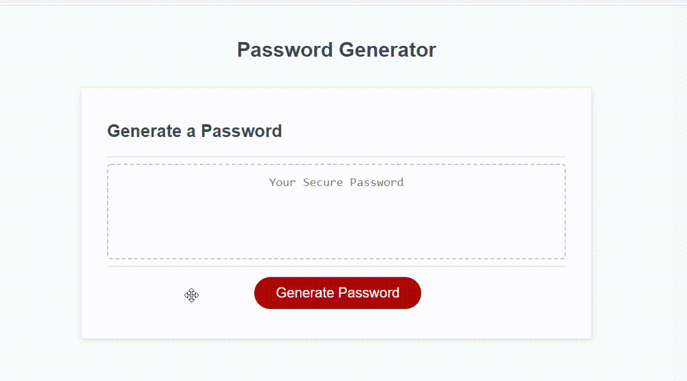

# password generator

## Description
- This project is a Password Generator, it will ask the user for the length of the password which is between 8 and 128, then it will ask for character options such as numbers, lowercase, uppercase and symbols.
- The application asks you for restart if the rules are not met. 

## Deployed Application 

https://michaelwall8.github.io/passwordgenerator/